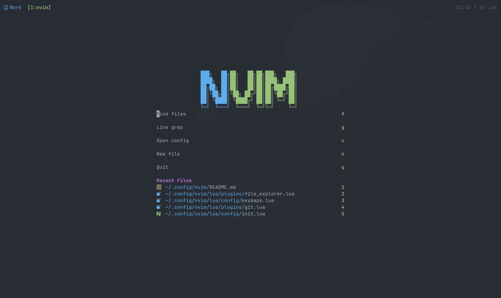

# Neovim Config

Personal Neovim config written in Lua. It uses Neovim's built-in `vim.pack.add()` plugin manager instead of `lazy.nvim`.



## Structure

```txt
~/.config/nvim/
├── init.lua
├── lsp/                 # per-server LSP config
└── lua/
    ├── config/          # options, autocmds, keymaps
    └── plugins/         # plugin setup split by feature
```

`init.lua` loads two modules:

```lua
require("config")
require("plugins")
```

## Plugin Areas

- `plugins/colorscheme.lua`: `navarasu/onedark.nvim` theme
- `plugins/completions.lua`: `blink.cmp`, `LuaSnip`, snippets
- `plugins/dashboard.lua`: `snacks.nvim` dashboard/start screen
- `plugins/file_explorer.lua`: `neo-tree.nvim` sidebar file explorer
- `plugins/formatting.lua`: `conform.nvim` format-on-save
- `plugins/git.lua`: `gitsigns`, `vim-fugitive`, `zdiff`
- `plugins/markdown.lua`: `render-markdown.nvim` Markdown renderer
- `plugins/navigation.lua`: Telescope and Harpoon
- `plugins/lsp.lua`: Mason, LSP setup, LSP keymaps
- `plugins/qol.lua`: lualine, mini.nvim modules, notifications
- `plugins/treesitter.lua`: Treesitter parser setup via `ts-forge`

## Important Keymaps

Leader key is `Space`.

```txt
<Space>so       source/reload config
<Space>re       restart Neovim and restore session
<Space>config   open this Neovim config
<Space>w        save file
<Space>q        quit current window/buffer
<Space>e        toggle Neo-tree sidebar
<Space>st       open Snacks dashboard/start screen
<Space>sf       find files with Telescope
<Space>sg       live grep with Telescope
<Space>sb       search buffers
<Space>sk       search keymaps
<Space>mr       toggle Markdown rendering
<Space>ah       add current file to Harpoon
<Space>h        open Harpoon menu
<Space>1..5     jump to Harpoon files
```

## LSP Keymaps

These are available after an LSP server attaches to a buffer.

```txt
gd              go to definition
gi              go to implementation
gr              find references
<Space><Space>  hover documentation
<Space>D        type definition
<Space>rn       rename symbol
<Space>ca       code action
<Space>f        format buffer
<Space>d        diagnostics float
<Space>i        toggle inlay hints
```

## Formatting

Formatting runs on save through `conform.nvim`.

Configured formatters:

```txt
Lua              stylua
JavaScript       prettierd
TypeScript       prettierd
React/TSX        prettierd
GraphQL          prettierd
Go               goimports + gofmt
JSON             prettierd
SQL              sql_formatter --language postgresql
```

## Plugin Maintenance

Plugins are declared with `vim.pack.add()` inside each `lua/plugins/*.lua` file.

Useful command:

```vim
:PackClean
```

Removes inactive plugins that are no longer declared in any `vim.pack.add()` spec.

Reload config:

```vim
<Space>so
```

Restart Neovim and restore session:

```vim
<Space>re
```
